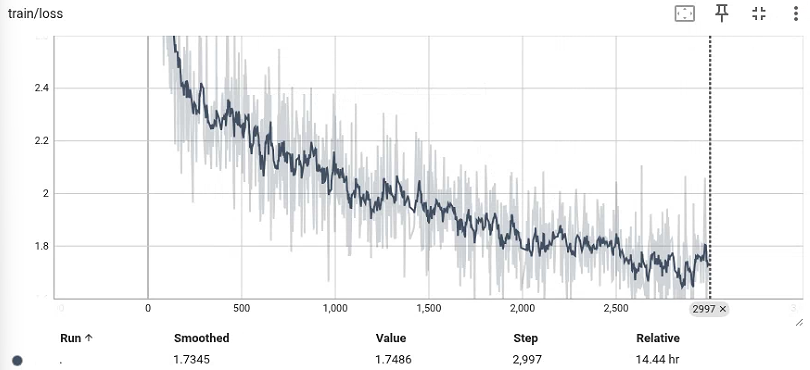

# RECAP-Pi0.5 for PiperX in Genesis

This repository contains the complete PiperX data-to-policy workflow used in the project: scripted Genesis demonstrations, Pi0.5 supervised fine-tuning, real-time chunking (RTC), policy rollout, online IK correction, a Pi0.5 VLM value model, and two stages of advantage-conditioned VLA fine-tuning.

Large model checkpoints and generated datasets are distributed separately through Google Drive. The repository includes `data/` and `ckpts/` placement guides, while Git ignores the downloaded contents. Copying those folders supplies the artifacts; the two Python environments and the one-time path preparation below are also required.

## Evaluation results

Each model completed 20 trials per task using scene seeds 40000–40019, for 120 trials per column. Cells show success rate (successful trials / total trials). The first two columns use the same 600-demo SFT checkpoint; the final column uses the VLA checkpoint after the 960-episode, value-conditioned fine-tuning stage, evaluated without RTC.

| Instruction | 600-demo SFT + RTC | 600-demo SFT, no RTC | Final all-data VLA (960), no RTC |
|---|---:|---:|---:|
| Put the red cube on the red cylinder | 95% (19/20) | 65% (13/20) | 60% (12/20) |
| Put the red cube on the blue cube | 100% (20/20) | 75% (15/20) | 50% (10/20) |
| Put the red cylinder on the red cube | 95% (19/20) | 70% (14/20) | 65% (13/20) |
| Put the red cylinder on the blue cube | 90% (18/20) | 55% (11/20) | 25% (5/20) |
| Put the blue cube on the red cube | 95% (19/20) | 75% (15/20) | 45% (9/20) |
| Put the blue cube on the red cylinder | 90% (18/20) | 65% (13/20) | 60% (12/20) |
| **Overall** | **94.2% (113/120)** | **67.5% (81/120)** | **50.8% (61/120)** |

All three runs use a 600-control-step limit at 20 Hz (30 simulated seconds) and the recorded `released_on_top_v1` criterion: XY error within 2 cm, height error within 5 mm, gripper closure at most 0.5, source–destination contact, and no source–robot contact. This criterion does not require retreat, a two-second stability hold, or an undisturbed third object, so these rates do not establish success under the stricter challenge criterion.

All runs predict a 50-step action horizon. The no-RTC runs execute 10 actions per inference with 20 parallel environments and `fast_chunk_step=true`; the RTC run uses asynchronous execution with `min_exec_horizon=10`, one environment, and `fast_chunk_step=false`. The execution configurations therefore differ beyond the RTC guidance setting. Separate reversal trials are excluded from this table.

<details>
<summary>Source evaluation reports</summary>

Counts were checked against the per-trial `report.json` files and the `standard/summary.json` in each run:

- RTC: `piperx_600only_rtc_eval_20260925_172514`
- No RTC: `piperx_600only_no_rtc_eval_20260925_172558`
- Final all-data VLA: `piperx_all960_eval_20260925_151633`

</details>

## Repository layout

```text
pi0.5-recap/
├── data/                        # destination for the downloaded data folder
├── ckpts/                       # destination for the downloaded models folder
├── piperx_data_engine/          # Genesis collection, rollout export, and IK correction
│   ├── piperx_data_engine/
│   ├── install.sh
│   └── README.md
├── third_party/
│   ├── README.md                # RLinf installation and fork attribution
│   └── RLinf/                   # Modified RLinf: Pi0.5, RTC, evaluation, and RECAP
└── workflows/
    ├── 01_collect_data.sh
    ├── 02_finetune_pi05.sh
    ├── 03_run_rtc.sh
    ├── 04_rollout_current_policy.sh
    ├── 05_ik_correction.sh
    ├── 06_train_value_vlm.sh
    ├── 07_finetune_all_true_vla.sh
    ├── 08_finetune_value_conditioned_vla.sh
    ├── configs/                 # Path-free YAML templates for stages 6–8
    └── env.example
```

## Downloaded artifact placement

Upload these two source folders separately to Google Drive:

- local data source: `/home/ajifang/genesis-world/vla/stacking/data`
- local model source: `/home/ajifang/models`

After downloading, copy the **contents** of the Drive `data` folder into `data/`, and copy the **contents** of the Drive `models` folder into `ckpts/`. Do not add another nested `data/data` or `ckpts/models` level. The complete expected trees and the purpose of every directory are documented in `data/README.md` and `ckpts/README.md`.

Complete installation before running the preparation command below. The 600-demo dense checkpoint must be included: the value checkpoint and both later VLA adapters depend on it. A dated training-run directory inside `finetune_with_collectedD_ckpt/` is accepted by the preparation script.

The `artifacts/` behavior is unchanged: evaluation HTML, generated label reports, and new training outputs remain there unless a command explicitly overrides its output path. Rendered workflow configs remain under `workflows/generated/`.

The ownership boundary is deliberate:

- `piperx_data_engine` owns the Genesis scene and every operation that creates or converts trajectory data.
- `third_party/RLinf` owns Pi0.5 training and inference, RTC, the value VLM, advantage labeling, and VLA updates.
- `workflows` only wires those two components together. It does not contain another copy of RTC or RECAP.

The modified RTC implementation that was developed for this project is already included under:

- `third_party/RLinf/rlinf/models/embodiment/openpi_rlinf/sampling/rtc_guidance.py`
- `third_party/RLinf/rlinf/workers/env/rtc_env_worker.py`
- `third_party/RLinf/rlinf/workers/rollout/hf/rtc_huggingface_worker.py`
- `third_party/RLinf/evaluations/piperx/`

The optional paired RTC analysis tools remain in `third_party/RLinf/evaluations/piperx/`:

1. `plot_paired_joint_curves.py`
2. `print_rtc_action_comparison.py`
3. `run_paired_joint_comparison.sh`

## Installation

Use Linux with an NVIDIA GPU and EGL support, Git, and Conda. Use two Python environments: Genesis and video export run in the data environment; Pi0.5 and RECAP run in the RLinf environment.

Install the data engine using the source revisions used for the released data. The installer also applies the included Genesis neutral-collision fix from the collection environment:

```bash
cd /path/to/pi0.5-recap
export PROJECT_ROOT="$PWD"
export PIPERX_DEPENDENCIES="$HOME/piperx-dependencies"
mkdir -p "$PIPERX_DEPENDENCIES"

git clone https://github.com/Genesis-Embodied-AI/genesis-world.git "$PIPERX_DEPENDENCIES/Genesis"
git -C "$PIPERX_DEPENDENCIES/Genesis" checkout 70199bce0d27da9fdcfb8d033269ef4e53d78f8c
git clone https://github.com/huggingface/lerobot.git "$PIPERX_DEPENDENCIES/lerobot"
git -C "$PIPERX_DEPENDENCIES/lerobot" checkout b6ec0060779550c0a157ae34feb89e0cf86012a8

cd "$PROJECT_ROOT/piperx_data_engine"
GENESIS_ROOT="$PIPERX_DEPENDENCIES/Genesis" \
LEROBOT_ROOT="$PIPERX_DEPENDENCIES/lerobot" \
ENV_NAME=piperx_data \
bash install.sh
```

Install the bundled modified RLinf source:

```bash
cd "$PROJECT_ROOT/third_party/RLinf"

bash requirements/install.sh embodied \
  --model openpi \
  --env libero
```

Training and inference use RLinf's PyTorch `openpi_rlinf` model. The installer's `openpi` target also installs the tokenizer and data-transform dependencies; a separate OpenPI checkout or JAX training setup is not required.

## Configure the downloaded artifacts once

Create your machine's configuration:

```bash
cd /path/to/pi0.5-recap
export PROJECT_ROOT="$PWD"
cp workflows/env.example workflows/local.env
conda run -n piperx_data python -c 'import sys; print(sys.executable)'
```

Set `DATA_PYTHON` in `workflows/local.env` to the interpreter printed by the last command. The default `RLINF_PYTHON` points to the bundled RLinf `.venv`; change it only if you installed RLinf elsewhere. Then prepare the downloaded checkpoints:

```bash
source workflows/local.env
"$RLINF_PYTHON" workflows/prepare_downloaded_artifacts.py \
  --checkpoint-root "$CHECKPOINT_ROOT"
```

Preparation normalizes the dense checkpoint directory and updates the saved base paths in the two VLA adapter manifests and the value checkpoint. Run it again if you subsequently move `ckpts/`. All numbered workflows load `local.env` automatically; explicit exported variables and command-prefix variables override its defaults. Source it in a new terminal before using the README commands that refer to `$PROJECT_ROOT` or other shell variables.

To evaluate the downloaded final policy immediately, run:

```bash
cd "$PROJECT_ROOT"
POLICY_CHECKPOINT="$FINAL_POLICY_CHECKPOINT" \
RTC_OUTPUT="$PROJECT_ROOT/artifacts/downloaded_final_eval_$(date +%Y%m%d_%H%M%S)" \
bash workflows/03_run_rtc.sh \
  runner.rtc.enabled=False \
  actor.model.num_action_chunks=10
```

This uses the existing evaluation protocol: 10 scenes per task, a 600-control-step limit, and a separate fixed-scene reversal test. It writes `watch.html` under the printed result directory. For RTC, run the same workflow without the two overrides. `POLICY_CHECKPOINT` can also select `$SFT_POLICY_CHECKPOINT` or `$POSITIVE_POLICY_CHECKPOINT`.

To retrain using the downloaded datasets, stages 6–8 can be run directly in a fresh configured terminal:

```bash
bash workflows/06_train_value_vlm.sh
bash workflows/07_finetune_all_true_vla.sh
bash workflows/08_finetune_value_conditioned_vla.sh
```

Each command uses the input checkpoints mapped in `local.env` and writes a new output directory under `artifacts/`. These three direct commands do not automatically replace one another's input checkpoints. To chain newly trained outputs instead, follow the exports in the numbered workflow below. To use the downloaded final policy, training is unnecessary.

The following eight stages show the complete pipeline, including new collection and training. Their output paths are new experiment directories; repeat runs need new output names. Every script runs in the foreground.

### 1. Collect data from scratch

The default command collects 100 successful demonstrations for each of the six ordered source-destination pairs, for 600 LeRobot episodes. It records only the fixed third-person and wrist cameras.

```bash
cd "$PROJECT_ROOT"

export DEMO_RUN="$PROJECT_ROOT/artifacts/demonstrations_v1"
export DEMO_RAW="${DEMO_RUN}_raw"
export DEMO_DATASET="${DEMO_RUN}_lerobot"
export CALIBRATION="${DEMO_RAW}/cameras.json"
# Train on this new collection only, without the downloaded supplemental set.
export SFT_SECOND_DATASET=""

EPISODES_PER_PAIR=100 \
COLLECT_ENVS=6 \
TRAIN_SEED_START=1000 \
bash workflows/01_collect_data.sh
```

The raw directory contains replayable NPZ trajectories and scene metadata. The LeRobot directory contains Parquet records and two H.264 camera streams.

### 2. Fine-tune Pi0.5 on the self-collected dataset

The script first calculates state/action normalization statistics from `DEMO_DATASET` when `NORM_STATS` does not exist. After stage 1, `SFT_SECOND_DATASET` is empty and all new demonstrations are used. With the downloaded defaults instead, it reproduces the released 600-episode mixture: 500 episodes from the main collection excluding `put the red cube on the red cylinder`, plus 100 supplemental red-cylinder-source episodes. The PiperX loader reads all configured LeRobot v3 sources and both cameras. It then runs the bundled RLinf Pi0.5 LoRA SFT configuration. Keep the supplied `NORM_STATS` when evaluating the supplied checkpoints; use newly calculated statistics with newly trained checkpoints.

```bash
cd "$PROJECT_ROOT"

export NORM_STATS="$DEMO_DATASET/norm_stats.json"
export SFT_LOG_ROOT="$PROJECT_ROOT/artifacts/pi05_sft_v1"

SFT_STEPS=5000 \
SFT_BATCH_SIZE=4 \
bash workflows/02_finetune_pi05.sh
```

After training, point the next stages at the actor directory actually written by RLinf:

```bash
export SFT_POLICY_CHECKPOINT=/absolute/path/to/checkpoints/global_step_5000/actor
```

### 3. Run RTC

Since the RLinf revision used in this project provided only approximate RTC guidance, I edited [`rtc_guidance.py`](third_party/RLinf/rlinf/models/embodiment/openpi_rlinf/sampling/rtc_guidance.py) following the original paper, [Real-Time Execution of Action Chunking Flow Policies](https://arxiv.org/abs/2506.07339), to implement its guidance formulation.

This runs the standard six-pair evaluation and the fixed-scene reversal test through RLinf's asynchronous RTC worker. The policy predicts a 50-step action horizon while RTC overlaps execution with the next inference request.

```bash
cd "$PROJECT_ROOT"

export POLICY_CHECKPOINT="$SFT_POLICY_CHECKPOINT"
export RTC_OUTPUT="$PROJECT_ROOT/artifacts/rtc_eval_v1"

RTC_EXEC_HORIZON=10 \
bash workflows/03_run_rtc.sh
```

The HTML report is written to `$RTC_OUTPUT/watch.html`. The simulator bridge imports the scene from `piperx_data_engine`; no RTC files are copied into the data engine.

For a matched RTC/no-RTC joint-trajectory comparison, use the retained RLinf analysis entrypoint after exporting the same runtime paths:

```bash
export PIPERX_POLICY_CHECKPOINT="$POLICY_CHECKPOINT"
export PIPERX_NORM_STATS="$NORM_STATS"
export PIPERX_PROJECT_ROOT="$PROJECT_ROOT/piperx_data_engine"
export PIPERX_PYTHON="$DATA_PYTHON"
export PIPERX_CALIBRATION="$CALIBRATION"
export PIPERX_PAIRED_ROOT="$PROJECT_ROOT/artifacts/rtc_paired_v1"

cd "$PROJECT_ROOT/third_party/RLinf"
bash evaluations/piperx/run_paired_joint_comparison.sh
"$RLINF_PYTHON" evaluations/piperx/print_rtc_action_comparison.py "$PIPERX_PAIRED_ROOT" --call 1
```

`run_paired_joint_comparison.sh` invokes `plot_paired_joint_curves.py` automatically. All three comparison tools remain under `third_party/RLinf/evaluations/piperx/` beside the RTC implementation they inspect.

### 4. Roll out the current policy

The default rollout uses 50 disjoint seeds for every ordered pair, which produces 300 episodes. It disables RTC so failures reflect the current chunked policy before any expert intervention. Every exported LeRobot frame contains `is_success`, while the raw directory retains reports, reset snapshots, actions, and videos for later replay.

```bash
cd "$PROJECT_ROOT"

export POLICY_CHECKPOINT="$SFT_POLICY_CHECKPOINT"
export ROLLOUT_ROOT="$PROJECT_ROOT/artifacts/current_policy_rollouts_v1"
export ROLLOUT_DATASET="$PROJECT_ROOT/artifacts/current_policy_rollouts_v1_lerobot"

ROLLOUT_EPISODES_PER_PAIR=50 \
ROLLOUT_SEED_START=30000 \
PARALLEL_ENVS=30 \
EXEC_STEPS=10 \
bash workflows/04_rollout_current_policy.sh

export SOURCE_ROLLOUT_ROOT="$ROLLOUT_ROOT"
```

`PARALLEL_ENVS` controls Genesis rollout concurrency. Reduce it if host RAM, CPU, or EGL contexts become the bottleneck.

### 5. Add online IK corrections

This stage replays selected failed policy trajectories. The policy prefix stops at the first observable failure, and the scripted IK teacher completes the task from that state. The raw archive keeps both parts and an `is_expert` mask; the LeRobot export contains only the contiguous expert suffix.

```bash
cd "$PROJECT_ROOT"

export CORRECTION_RAW="$PROJECT_ROOT/artifacts/ik_corrections_v1_raw"
export CORRECTION_DATASET="$PROJECT_ROOT/artifacts/ik_corrections_v1_lerobot"

CORRECTION_QUOTAS=6,6,9,7,3,4 \
WATCHDOG_SECONDS=3.0 \
ROLLOUT_ROOT="$SOURCE_ROLLOUT_ROOT" \
bash workflows/05_ik_correction.sh
```

The watchdog uses the first applicable condition:

- no approach progress into the 4 cm TCP-source region for 3 seconds;
- TCP reached the source, but gripper closure never exceeded 0.65 within 3 seconds;
- TCP reached and the gripper closed, but source lift never reached 3 cm within 3 seconds;
- after a real lift, source height dropped below 2.5 cm.

Correction videos are indexed at `$CORRECTION_RAW/preview_videos/watch.html`.

The quotas are target counts in task order. Stage 5 uses `--allow-partial`: if candidates run out or some IK recoveries fail, it exports the successful corrections already saved. The report retains the requested count, actual count, and `target_reached` status. At least one successful correction is needed for this export. The released collection targeted 35 corrections and saved 26 successful expert suffixes. The downloaded raw-rollout paths and camera calibration are supplied by `local.env`, so stage 5 can also operate on those downloaded trials after selecting a new correction output directory.

### 6. Train the RECAP value VLM on demonstrations and failed trajectories

The stage first exports every failed rollout as a failure-only LeRobot set. It calculates returns with the same reward convention used by the value model, then trains a categorical value head plus Pi0.5 VLM LoRA on successful demonstrations and failures.

```bash
cd "$PROJECT_ROOT"

export FAILURE_DATASET="$PROJECT_ROOT/artifacts/policy_failures_v1_lerobot"
export VALUE_OUTPUT="$PROJECT_ROOT/artifacts/value_vlm_v1"

VALUE_BATCH_SIZE=8 \
VALUE_STEPS=3000 \
ROLLOUT_ROOT="$SOURCE_ROLLOUT_ROOT" \
bash workflows/06_train_value_vlm.sh

export VALUE_CHECKPOINT="$VALUE_OUTPUT/pi05_value_final.pt"
export GLOBAL_RETURN_MIN="$("$RLINF_PYTHON" -c 'import json, sys; print(json.load(open(sys.argv[1]))["global_return_min"])' "$VALUE_OUTPUT/training_summary.json")"
```

The reward is `-1` per step, `0` at successful termination, and `-300` at failed termination, with `gamma=1`. Returns are normalized from the observed global minimum to `[-1, 0]`. The value trainer saves `training_summary.json`, including the exact normalization minimum used by stage 8.



### 7. Fine-tune the VLA with rollout successes and corrected expert suffixes

This stage builds one positive LeRobot dataset from successful current-policy rollouts plus the IK expert suffixes. Every frame receives `advantage=True`, and every prompt is conditioned with `Advantage: positive`. The value VLM is not used in this stage.

```bash
cd "$PROJECT_ROOT"

export POSITIVE_DATASET="$PROJECT_ROOT/artifacts/positive_rollout_corrections_v1_lerobot"
export POSITIVE_POLICY_OUTPUT="$PROJECT_ROOT/artifacts/all_true_policy_v1"

POSITIVE_POLICY_STEPS=3000 \
POLICY_BATCH_SIZE=8 \
REPLAY_ENVS=12 \
ROLLOUT_ROOT="$SOURCE_ROLLOUT_ROOT" \
bash workflows/07_finetune_all_true_vla.sh

export POSITIVE_POLICY_CHECKPOINT="$POSITIVE_POLICY_OUTPUT/checkpoints/global_step_3000/actor"
```

This is the deliberate all-positive bootstrap stage. It fine-tunes the Pi0.5 VLM LoRA and action-expert LoRA while keeping the vision encoder frozen.

### 8. Fine-tune the VLA on all collected data with value-derived binary advantage

First collect 10 fresh rollouts for each task with the all-positive policy:

```bash
cd "$PROJECT_ROOT"

export POLICY_CHECKPOINT="$POSITIVE_POLICY_CHECKPOINT"
export ROLLOUT_ROOT="$PROJECT_ROOT/artifacts/post_bootstrap_rollouts_60"
export ROLLOUT_DATASET="$PROJECT_ROOT/artifacts/post_bootstrap_rollouts_60_lerobot"

ROLLOUT_EPISODES_PER_PAIR=10 \
ROLLOUT_SEED_START=40000 \
bash workflows/04_rollout_current_policy.sh

export NEW_ROLLOUT_DATASET="$ROLLOUT_DATASET"
```

Use fresh seeds for these new rollouts; the example uses 40000–40009 after stage 4 used 30000–30049. The final stage starts from `POSITIVE_POLICY_CHECKPOINT`. The released 960-episode run uses four sources:

1. 600 scripted demonstrations;
2. 227 successful rollouts from the original 300-rollout set;
3. 73 failed rollouts from that same set;
4. 60 fresh rollouts from the all-positive policy.

It computes temporal advantages, selects a single global threshold, and maps `1` to `instruction + "Advantage: positive"` and `0` to the original instruction. `force_sft_positive` is `true`: scripted demonstrations and known successful rollouts remain positive, while the value VLM supplies binary labels for rollout data whose outcome may be negative.

```bash
cd "$PROJECT_ROOT"

export FINAL_POLICY_OUTPUT="$PROJECT_ROOT/artifacts/value_conditioned_policy_v1"
export VALUE_LABEL_REPORT="$PROJECT_ROOT/artifacts/value_labels_v1.json"

FINAL_POLICY_STEPS=5000 \
POLICY_BATCH_SIZE=8 \
VALUE_INFERENCE_BATCH_SIZE=128 \
ADVANTAGE_POSITIVE_FRACTION=0.30 \
bash workflows/08_finetune_value_conditioned_vla.sh
```

The final checkpoint is written under:

```text
$FINAL_POLICY_OUTPUT/checkpoints/global_step_5000/actor
```

The generated label report records the value checkpoint, threshold, positive and negative frame counts, and every source dataset. The rendered YAML files remain under `workflows/generated/` for experiment auditing.

## Dataset roles

| Artifact | Contains | Used by |
|---|---|---|
| `DEMO_DATASET` | Scripted successful demonstrations | Pi0.5 SFT, value VLM, final VLA |
| `FAILURE_DATASET` | Failed rollout trajectories only | Value VLM, final VLA |
| `CORRECTION_RAW` | Policy prefixes followed by IK recovery | Positive-dataset export |
| `POSITIVE_DATASET` | 227 rollout successes followed by 26 IK suffixes | All-true VLA; first 227 episodes in final VLA |
| `NEW_ROLLOUT_DATASET` | 60 rollouts from the all-positive policy | Final VLA |

Stage 8 reads the rollout-success count from `positive_export.json` and takes that prefix of `POSITIVE_DATASET`. For the released dataset this is 227 episodes, so its 26 correction suffixes are used for the all-positive bootstrap and are not counted again in the released 960-episode final run.

For the task definition, action space, camera setup, randomization ranges, and raw collection format, see `piperx_data_engine/README.md`. For the bundled RLinf fork and installation details, see `third_party/README.md`.
